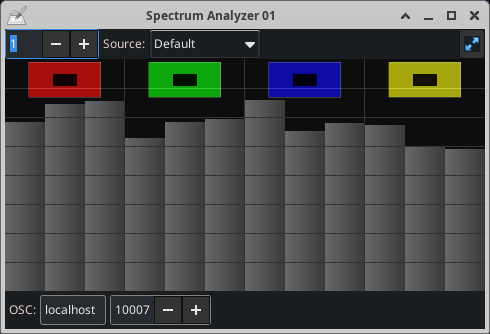

# Spectrum Analyzer

Real-time audio spectrum analyzer for Linux, with OSC output.

An updated and improved fork of [luz](https://github.com/lighttroupe/luz):
ported to GTK 3 and modern OpenGL, with low-latency PulseAudio/ALSA capture
and a log-spaced analysis covering 20 Hz–20 kHz.

## Build

    sudo apt-get install build-essential libasound2-dev libfftw3-dev liblo-dev libgtkmm-3.0-dev libepoxy-dev libpulse-dev
    make
    ./spectrum-analyzer
